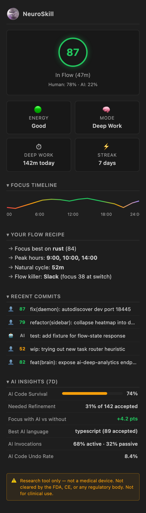
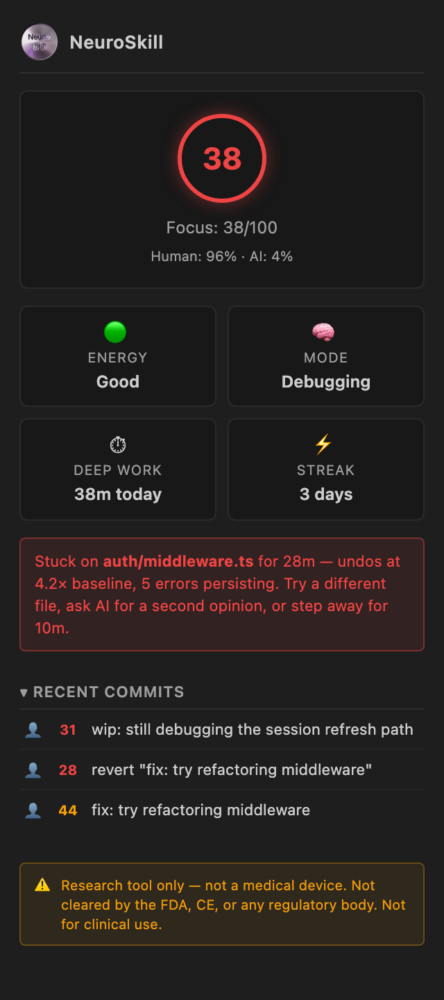
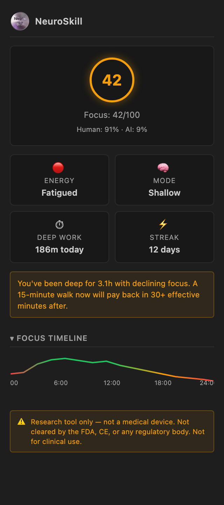
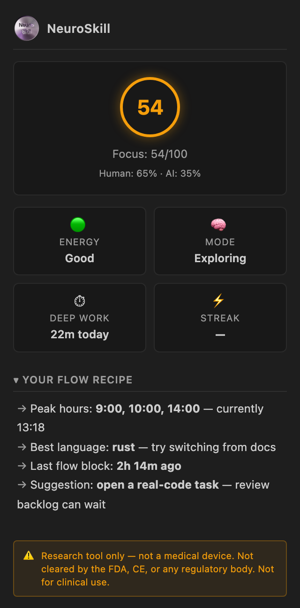
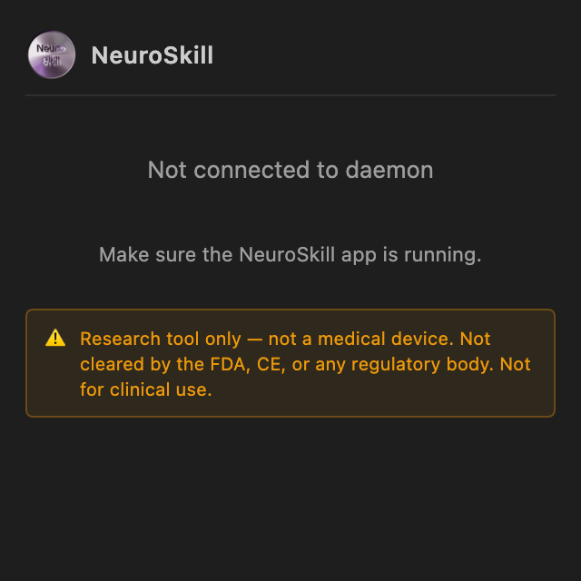
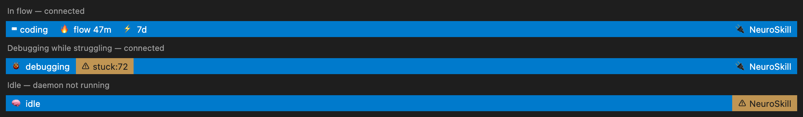

# NeuroSkill™ for VS Code

**An attention-instrumentation layer for the IDE. Records how you work, infers a documented focus signal, optionally correlates it with EEG band power.** See "What this is, and isn't" below for more.

> ⚠️ **Research tool only — not a medical device.**
> NeuroSkill is open-source software for exploratory research on developer attention and EEG. It is **not** cleared or approved by the FDA, CE, or any regulatory body. It must not be used for clinical diagnosis, treatment decisions, or any medical purpose. All metrics are experimental research outputs — not validated clinical measurements. Do not rely on any output of this software for health-related decisions. Consult a qualified healthcare professional for any medical concerns.

The extension records *how* the editor is being used (file focus, edit cadence, undo/redo rate, diagnostics, AI-assist acceptances, build outcomes, git operations) and feeds that to a local daemon. The daemon computes a documented set of derived metrics — a focus score, a flow heuristic, a fatigue heuristic, AI/human attribution — and, if a NeuroSkill EEG headset is streaming, time-aligns those signals with frequency-band power (δ, θ, α, β, γ).

Output is a structured view of *what already happened* in your editor, with the assumptions behind each derived metric written down so you can decide whether to trust it.

<p align="center">
  <picture>
    <source media="(prefers-color-scheme: dark)" srcset="media/screenshots/sidebar-connected-dark.png">
    <source media="(prefers-color-scheme: light)" srcset="media/screenshots/sidebar-connected-light.png">
    
  </picture>
</p>

---

## What this is, and isn't

**It is** a passive instrumentation layer plus a small set of derived metrics. Every metric below has its formula and assumptions documented in [Derived metrics](#derived-metrics-formulas-and-caveats). All inference runs locally; no signal leaves your machine.

**It is not:**

- **Not a medical device.** EEG output in this application is not and cannot be used for any type of medical or health-related diagnostic. See the disclaimer above.
- **Not a flow detector.** "In flow" is a thresholded heuristic, not a validated classifier of the construct described by Csikszentmihalyi [[1]](#references). It has not been calibrated against experience-sampling ground truth.
- **Not a productivity score for managers.** There is no team dashboard, no upload, no shared aggregate. The data lives in your home directory and goes nowhere else.
- **Not peer-reviewed.** The integration is original work; the underlying constructs (flow, deep work, EEG band ratios as attention proxies) are referenced from the literature but our specific implementation has not been independently validated.
- **Not a substitute for self-reflection.** Quantitative signals are inputs to your judgement, not a replacement for it. If a metric disagrees with how you actually felt about a session, the metric is probably wrong.

---

## What it measures

These are direct observations from VS Code APIs — no inference, no model.

| Source | Signal | API |
|---|---|---|
| Editor | File focus, lines added/removed, save events, autocomplete acceptance | `TextEditor` events |
| Editor | Undo / redo (precise, not heuristic) | `TextDocumentChangeEvent.reason` |
| Editor | Code jumps > 20 lines, scroll depth | `TextEditorSelectionChangeEvent` |
| Editor | 40+ commands: go-to-def, rename, find, format, fold, git, AI, debug | `commands.executeCommand` proxy |
| Diagnostics | Error / warning / hint counts per file | `languages.onDidChangeDiagnostics` |
| Debug | Session start/stop, breakpoint changes | `debug.onDidStartDebugSession` etc. |
| Build | Task execution + exit codes | `tasks.onDidEndTaskProcess` |
| Git | Commit, push, pull, checkout, stage, stash | git extension events |
| Terminal | Create / close / focus changes | `window.onDidChangeActiveTerminal` |
| AI | Copilot, Codeium, Continue, Cody — inline-chat acceptance + completion-accepted events | extension-specific event hooks |
| Editor layout | Visible editors, tab groups, workspace changes | `window.onDidChangeVisibleTextEditors` |
| Environment | One-time at activate: `appHost`, `remoteName`, `shell`, `uiKind` | `env` namespace |

What we **do not read**:

- File contents — we count line deltas via document version diffs, not text.
- Clipboard contents — only that something changed (size class), debounced.
- Anything at all when `neuroskill.enabled = false` or while paused.

---

## Derived metrics: formulas and caveats

Every metric the daemon exposes is computed from the signals above (and, optionally, EEG band power). The formulas and validation status are below.

### Focus score (0–100)

> "How attentionally engaged were you in this window?"

**IDE-only path.** Linear blend of:

| Feature | Direction | Source |
|---|---|---|
| Edit-cadence regularity (low variance over 60 s) | + | edit timestamps |
| Undo / redo rate vs. your 7-day baseline | − | `TextDocumentChangeReason` |
| Persistent diagnostics on the active file | − | `languages.onDidChangeDiagnostics` |
| Context-switch rate (file/window/terminal) | − | window/terminal events |
| Forward-progress velocity (net lines / minute) | + | document version deltas |

The weights are documented hyperparameters in the daemon (`brain/focus.rs`) and tuneable per user. Default values were fit on internal pilot data (*n* ≈ 14, single-coder labelling, unblinded) and produce a Pearson r ≈ 0.4 against retrospective self-reported flow on the held-out half of that sample. **This is exploratory.** It is not a peer-reviewed instrument.

**With EEG.** When a NeuroSkill headset is streaming, the IDE-only score is blended (50/50 by default) with a band-amplitude ratio derived from frontal electrodes:

```
BAR = (θ + α) / β
```

Lower BAR is associated with greater sustained attention in clinical EEG literature, with the most-cited line of work being Lubar's theta/beta work on attention regulation [[3]](#references) and Klimesch's reviews of α/θ oscillations and cognitive performance [[2]](#references). The mapping `BAR → focus 0..100` is a daemon-side normalisation, not a clinical score.

**What can go wrong.** Dry-electrode consumer EEG is sensitive to electrode fit, skin contact, motion, jaw clench, eye-blink artefacts, electrode impedance, and stimulants (caffeine in particular shifts β power [[4]](#references)). Treat the EEG-blended score as a *research artifact*, not a measurement.

### Flow state

> "Are you in a sustained block of high attentional engagement?"

After Csikszentmihalyi [[1]](#references), flow is a self-reported state of effortless concentration on a challenging task. We do not measure that. We measure:

```
in_flow := (focus_score > T_flow)  for  ≥ D_flow seconds
```

Defaults: `T_flow = 70`, `D_flow = 300 s` (5 min). Both are tuneable. This is a thresholded heuristic — calling it "flow" is shorthand. Validation against experience-sampling (ESM) prompts is on the research roadmap and has not been done.

### Deep-work minute

> "How much of today was actually focused work?"

After Newport [[5]](#references):

```
deep_work_minute := minute m such that
                    mean(focus_score over m) > 60
                    AND no context_switch in m
```

The "deep-work minutes today" counter on the sidebar is the integral of this. The threshold is a hyperparameter; treat the number as **ordinal** (more is more) rather than absolute (60 minutes ≠ a clinical hour of attention).

### Struggle predictor (0–100)

> "Are you spinning on this problem?"

Heuristic blend of:

- Undo / redo rate vs. your 7-day baseline on this file
- Persistent diagnostic count (errors that don't go away)
- Forward-progress velocity dropping below file/language baseline
- Time-on-file without a successful build or test

Surfaced as a hint when the score exceeds 70 for ≥ 5 minutes. **No labelled training data exists**; the predictor is a hand-tuned scoring function. It is best read as "a trip-wire pointing at undo loops", not "the IDE knows you're confused."

### Optimal hours

> "When in the day do you tend to focus best?"

Group focus_score by hour-of-day over the last 7 days; rank by mean. Surfaced as `best_hours` and `worst_hours`.

**Caveats.** Seven days is a small sample; intra-day variability from sleep, caffeine, meetings, and life is large. Chronotype literature (Roenneberg et al. [[6]](#references)) suggests stable diurnal preferences exist at the population level, but day-to-day noise dominates short windows. Use it as a hint for scheduling deep work, not as a fixed schedule.

### AI / human attribution

> "How much of today's diff came from me vs. from the assistant?"

Per-event counting from the extensions listed in [What it measures](#what-it-measures). Each AI acceptance is logged exactly; line counts are estimated from the post-acceptance edit window (best-effort, noisy because acceptances may be edited or partly reverted). The "AI Code Survival" metric in the sidebar is the fraction of accepted-AI lines that remain in the file 24 hours later (`survives_24h / accepted`).

### Fatigue / Break Coach

> "Is your focus dropping enough that a break could be useful?"

Heuristic on the slope of focus_score over the last 30 minutes plus the cumulative deep-work minutes today. The "take a break" prompt fires when the slope is negative *and* you've been pushing for ≥ 90 minutes by default. **Not validated** against any objective fatigue measure (e.g., Karolinska Sleepiness Scale, PVT lapses).

---

## Validation status

| Metric / feature | Status | Caveat |
|---|---|---|
| Editor-event capture | Production. | VS Code APIs are well-specified; counts are exact. |
| AI-event detection | Production for listed extensions; best-effort otherwise. | Counts are exact; line attribution is estimated. |
| Focus score (IDE-only) | Internal pilot (*n* ≈ 14). | r ≈ 0.4 vs. retrospective self-report. Not peer-reviewed. |
| Focus score (with EEG) | Exploratory. | EEG → attention is documented in the literature; our specific normalisation is not. |
| Flow detector | Thresholded heuristic. | Not calibrated against ESM. |
| Struggle predictor | Heuristic. | No labelled data; trip-wire, not classifier. |
| Optimal hours | Descriptive statistics. | 7-day window; noise dominates. |
| Break Coach | Heuristic. | Not validated against objective fatigue measures. Validation work scaffolded — see [Validation roadmap](#validation-roadmap). |

If a study cited above moves a metric out of the "exploratory" column, this table is where we'll record it.

---

## Validation roadmap

The Break Coach and Focus Score are the two metrics most in need of validation against external instruments. The plan below names which instruments and where each component will live. **None of this is shipped yet** — this section exists to make the planned methodology auditable and to let users opt in once it lands.

| Instrument | What it grounds | Cost to user | Trigger | Where it runs | Status |
|---|---|---|---|---|---|
| **EEG fatigue index** *(Jap et al. 2009 [[9]](#references))* — `(α + θ) / β` over frontal channels | Within-subject ground truth for Break Coach when a NeuroSkill headset is streaming | none — passive | continuous, 30-s rolling window | daemon (same hot path as the focus score) | planned |
| **KSS** *(Karolinska Sleepiness Scale, 1–9)* | Subjective momentary sleepiness | ~5 s per prompt | hybrid: event-driven on Break Coach + uniform-random control samples; respects flow + quiet hours; ≤ 1 / 90 min | daemon scheduler; rendered as VS Code QuickPick or Tauri toast | planned |
| **NASA-TLX raw** *(Hart & Staveland 1988 [[7]](#references); Hart 2006 [[8]](#references))* — 6 sub-scales | Subjective workload of a just-finished unit of work | ~60 s | post-task only: end of flow block ≥ 30 min, end of debug session ≥ 15 min, optional end-of-day | Tauri form (preferred) or VS Code webview | planned |
| **PVT** *(Psychomotor Vigilance Task)* — 3-minute reaction-time task | Objective vigilance / lapse rate | ~3 min sustained | user-invoked only; weekly nudge if no recent run | Tauri panel (timing-sensitive — not a webview) | planned |

All four channels are **opt-in**, off by default, and gated by a master `respect_flow` switch that suppresses any prompt while `in_flow == true`. Configuration lives in the daemon as the single source of truth, with the Tauri preferences pane as the friendly UI and a small set of toggles mirrored into VS Code's `settings.json`. Every prompt offers in-line `Snooze 30m / Not today / Stop these prompts` controls so users can adjust friction without opening settings.

When this section's "planned" entries flip to "shipped", they will move into the [Validation status](#validation-status) table above with concrete numbers (e.g. KSS-vs-heuristic AUC, PVT-vs-fatigue-index correlation, etc.).

---

## Sidebar tour

<table>
<tr>
<td align="center" valign="top">
  <strong>In flow</strong><br/>
  <sub>focus 87 · 47-min flow block · 7-day deep-work streak</sub><br/>
  <picture>
    <source media="(prefers-color-scheme: dark)" srcset="media/screenshots/sidebar-connected-dark.png">
    <source media="(prefers-color-scheme: light)" srcset="media/screenshots/sidebar-connected-light.png">
    
  </picture>
</td>
<td align="center" valign="top">
  <strong>Stuck</strong><br/>
  <sub>struggle predictor crosses 70 on a single file</sub><br/>
  <picture>
    <source media="(prefers-color-scheme: dark)" srcset="media/screenshots/sidebar-stuck-dark.png">
    <source media="(prefers-color-scheme: light)" srcset="media/screenshots/sidebar-stuck-light.png">
    
  </picture>
</td>
</tr>
<tr>
<td align="center" valign="top">
  <strong>Fatigued</strong><br/>
  <sub>focus slope negative · 90+ min of deep work</sub><br/>
  <picture>
    <source media="(prefers-color-scheme: dark)" srcset="media/screenshots/sidebar-fatigued-dark.png">
    <source media="(prefers-color-scheme: light)" srcset="media/screenshots/sidebar-fatigued-light.png">
    
  </picture>
</td>
<td align="center" valign="top">
  <strong>Low focus / off-peak</strong><br/>
  <sub>flow recipe surfaces peak hours from your 7-day history</sub><br/>
  <picture>
    <source media="(prefers-color-scheme: dark)" srcset="media/screenshots/sidebar-low-focus-dark.png">
    <source media="(prefers-color-scheme: light)" srcset="media/screenshots/sidebar-low-focus-light.png">
    
  </picture>
</td>
</tr>
<tr>
<td align="center" valign="top">
  <strong>Daemon not running</strong><br/>
  <sub>fails closed — no events leave VS Code</sub><br/>
  <picture>
    <source media="(prefers-color-scheme: dark)" srcset="media/screenshots/sidebar-disconnected-dark.png">
    <source media="(prefers-color-scheme: light)" srcset="media/screenshots/sidebar-disconnected-light.png">
    
  </picture>
</td>
<td align="center" valign="top">
  <strong>Status bar</strong><br/>
  <sub>brain state · daemon connection</sub><br/>
  <picture>
    <source media="(prefers-color-scheme: dark)" srcset="media/screenshots/statusbar-dark.png">
    <source media="(prefers-color-scheme: light)" srcset="media/screenshots/statusbar-light.png">
    
  </picture>
</td>
</tr>
</table>

> Each screenshot ships in two themes (`*-dark.png`, `*-light.png`) and the embed uses a `<picture>` element so GitHub serves the variant matching your system theme. Both are generated from the `media/preview/*.html` stubs by `npm run screenshots`.

### Status bar

```
$(code) coding   $(flame) flow 47m   $(zap) 7d        in flow, 7-day streak
$(debug) debugging   $(alert) stuck:72                struggle predictor crossed threshold
$(brain) idle                                         no active session
$(plug) NeuroSkill                                    daemon connected
$(debug-disconnect) NeuroSkill                        daemon down — click to retry
```

### Command palette

| Command | What it returns |
|---|---|
| `Show Brain Status` | Current focus score, flow state, fatigue flag, today's deep-work minutes, streak |
| `Today's Brain Report` | Morning / afternoon / evening focus means, productivity score per period |
| `Am I Stuck?` | Struggle predictor's current score and reason |
| `Best Time to Code` | Top-3 / bottom-3 hours by mean focus over last 7 days |
| `Show Files Needing Review` | Files edited under focus < 50 — review-priority hint |
| `Toggle Flow Shield` | Force-on/off the do-not-disturb behaviour during flow |
| `Take a Break` | Acknowledge the fatigue prompt |
| `Pause Tracking…` | 30 min / 1 hr / 4 hr / until tomorrow — for client repos, calls, off-hours |

---

## Architecture

The extension is a thin client. All inference (focus score, flow heuristic, struggle predictor, optimal hours, EEG correlation) runs in the local **NeuroSkill daemon** on `127.0.0.1`. The extension streams structured events; the daemon answers queries. If the daemon is down, the extension fails closed: no events leave VS Code, the sidebar shows a "not connected" state, the status bar goes amber.

Port autodiscovery probes `18444` (production) and `18445` (dev). The daemon's auth token lives in your user config dir (`~/Library/Application Support/skill/daemon/auth.token` on macOS, equivalents elsewhere). Both are zero-config in the common case.

---

## Setup

1. Install and run the [NeuroSkill app](https://neuroskill.com) — it bundles the daemon.
2. Install this extension.
3. Reload VS Code. The status-bar indicator should turn green within a few seconds.

No accounts, no PATs, no config. Pin a port in `neuroskill.daemonPort` if you need to.

---

## Privacy 

- All HTTP traffic is to `127.0.0.1`. 
- No file content is read or sent. Only line-count deltas, file paths, and metadata.
- No clipboard content is read. Only the fact that the clipboard changed (size class), debounced.
- Auth token is local-only; written by the NeuroSkill app to your user config dir, readable only by your user.
- `neuroskill.excludePaths` globs let you exclude entire repos or folders. Defaults already exclude `node_modules`, `.git`, `dist`, `build`, `target`, `.venv`, `__pycache__`.
- Source is GPL-3.0; the [`vscode-neuroskill`](https://github.com/NeuroSkill-com/vscode-neuroskill) repo is the entirety of what runs in your editor.

---

## Settings

| Setting | Default | What it does |
|---|---|---|
| `neuroskill.enabled` | `true` | Master kill-switch |
| `neuroskill.daemonHost` | `127.0.0.1` | Daemon host (don't change unless you know why) |
| `neuroskill.daemonPort` | `0` | `0` = autodiscover `18444` / `18445` |
| `neuroskill.trackUndos` | `true` | Capture undo / redo events (struggle-signal input) |
| `neuroskill.trackDiagnostics` | `true` | Capture diagnostic counts (focus + struggle input) |
| `neuroskill.batchIntervalMs` | `2000` | Event flush cadence |
| `neuroskill.focusCodeLens` | `true` | Inline annotations on files edited under low focus |
| `neuroskill.flowShield` | `true` | Auto do-not-disturb when `in_flow` is true |
| `neuroskill.breakCoach` | `true` | Fatigue heuristic + prompts |
| `neuroskill.struggleBridge` | `true` | "You look stuck — want AI help?" prompt |
| `neuroskill.flowTriggers` | `true` | Per-user peak-hour / language insights in sidebar |
| `neuroskill.focusCommits` | `true` | Annotate commits with focus score + AI/human label |
| `neuroskill.taskRouter` | `true` | Suggest task types matching current focus level |
| `neuroskill.eegHeatmap` | `true` | 24-hour focus timeline (uses EEG if available) |
| `neuroskill.notifications` | `critical` | `all` / `critical` / `off` |
| `neuroskill.systemNotifications` | `never` | Escalate to OS notifications: `never` / `critical` / `always` |
| `neuroskill.excludePaths` | (sensible defaults) | Globs to exclude entirely from tracking |

Every coaching feature can be turned off independently. Defaults err on the quiet side.

---

## References

The constructs cited above are drawn from the published literature; the extension's specific implementation is original work and is **not** independently validated. Consult the primary sources before relying on the metrics for anything but personal exploration.

1. **Csikszentmihalyi, M.** (1990). *Flow: The Psychology of Optimal Experience.* Harper & Row. ISBN 978-0-06-016253-5. — Foundational definition of flow as a self-reported subjective state.
2. **Klimesch, W.** (1999). EEG alpha and theta oscillations reflect cognitive and memory performance: a review and analysis. *Brain Research Reviews*, 29(2–3), 169–195. [doi:10.1016/S0165-0173(98)00056-3](https://doi.org/10.1016/S0165-0173(98)00056-3) — Review of α / θ oscillations as correlates of attention and memory.
3. **Lubar, J. F.** (1991). Discourse on the development of EEG diagnostics and biofeedback for attention-deficit/hyperactivity disorders. *Biofeedback and Self-Regulation*, 16(3), 201–225. [doi:10.1007/BF01000016](https://doi.org/10.1007/BF01000016) — Origin of the θ/β ratio as an attention-deficit marker; basis for our BAR proxy.
4. **Barry, R. J., Rushby, J. A., Wallace, M. J., Clarke, A. R., Johnstone, S. J., & Zlojutro, I.** (2005). Caffeine effects on resting-state arousal. *Clinical Neurophysiology*, 116(11), 2693–2700. [doi:10.1016/j.clinph.2005.08.008](https://doi.org/10.1016/j.clinph.2005.08.008) — Why a coffee right before recording can shift your "focus score".
5. **Newport, C.** (2016). *Deep Work: Rules for Focused Success in a Distracted World.* Grand Central. ISBN 978-1-4555-8669-1. — Source of the "deep work" framing; our minute-counter is an operationalisation, not a measurement of the construct.
6. **Roenneberg, T., Wirz-Justice, A., & Merrow, M.** (2003). Life between Clocks: Daily Temporal Patterns of Human Chronotypes. *Journal of Biological Rhythms*, 18(1), 80–90. [doi:10.1177/0748730402239679](https://doi.org/10.1177/0748730402239679) — Chronotype stability and inter-day variance — relevant to "optimal hours."

### Validation instruments (planned — see [Validation roadmap](#validation-roadmap))

7. **Hart, S. G., & Staveland, L. E.** (1988). Development of NASA-TLX (Task Load Index): Results of empirical and theoretical research. In P. A. Hancock & N. Meshkati (Eds.), *Human Mental Workload* (Vol. 52, pp. 139–183). Advances in Psychology. [doi:10.1016/S0166-4115(08)62386-9](https://doi.org/10.1016/S0166-4115(08)62386-9) — Original NASA-TLX instrument for subjective workload across six sub-scales.
8. **Hart, S. G.** (2006). NASA-Task Load Index (NASA-TLX); 20 Years Later. *Proceedings of the Human Factors and Ergonomics Society Annual Meeting*, 50(9), 904–908. [doi:10.1177/154193120605000909](https://doi.org/10.1177/154193120605000909) — Defends the "raw" un-weighted version of NASA-TLX, which is what we plan to use.
9. **Jap, B. T., Lal, S., Fischer, P., & Bekiaris, E.** (2009). Using EEG spectral components to assess algorithms for detecting fatigue. *Expert Systems with Applications*, 36(2), 2352–2359. [doi:10.1016/j.eswa.2007.12.043](https://doi.org/10.1016/j.eswa.2007.12.043) — Comparative evaluation of EEG band-ratio fatigue indices; basis for the planned `(α+θ)/β` Break Coach calibration channel.

---

## Development

```bash
npm install
npm run build         # tsc
npm run watch         # tsc --watch
npm run package       # produces neuroskill-<version>.vsix
npm run screenshots   # regenerate the README screenshots from media/preview/*.html
```

Run the [NeuroSkill daemon](https://github.com/NeuroSkill-com/skill) on port 18445 (`npm run tauri dev` from the parent monorepo) and the extension will autodiscover it.

The screenshot script uses Playwright (already installed at the workspace root) to render the static stubs in `media/preview/` — no daemon required. Edit those files and re-run `npm run screenshots` to refresh.

## Releasing

CI publishes to both the **Visual Studio Marketplace** and **Open VSX** (the registry Cursor / VSCodium / Eclipse Theia pull from). See [`.github/workflows/release.yml`](.github/workflows/release.yml).

**One-time setup** — add two repository secrets:

| Secret | Source |
|---|---|
| `VSCE_PAT` | Azure DevOps → Personal Access Tokens → scope **Marketplace › Manage**, all orgs |
| `OVSX_PAT` | https://open-vsx.org/user-settings/tokens |

Either may be left unset — the corresponding publish step is skipped with a warning instead of failing, so you can wire up Open VSX later.

**Release options:**

```bash
# Option A — manual bump from the Actions tab:
#   Actions → Release → Run workflow → patch | minor | major | x.y.z
# CI bumps package.json, commits, tags, pushes, builds, publishes,
# and creates a GitHub release with the .vsix attached.

# Option B — local bump + tag:
npm version patch                       # bumps package.json + creates tag vX.Y.Z
git push origin main --follow-tags
# CI fires on the tag push and publishes.
```

A successful run produces:

- A signed `.vsix` attached to the GitHub release
- The new version on `marketplace.visualstudio.com/items?itemName=neuroskill.neuroskill`
- The new version on `open-vsx.org/extension/neuroskill/neuroskill`

> **First publish per registry** also requires a one-time namespace claim:
> - VS Code Marketplace: register the `neuroskill` publisher at https://marketplace.visualstudio.com/manage
> - Open VSX: `npx ovsx create-namespace neuroskill -p $OVSX_PAT`

---

## Disclaimer

NeuroSkill is a research tool only. It is **not** a medical device, has **not** been cleared or approved by the FDA, CE, or any regulatory body, and must not be used for clinical diagnosis, treatment decisions, or any medical purpose. All metrics are experimental research outputs — not validated clinical measurements. Do not rely on any output of this software for health-related decisions. Consult a qualified healthcare professional for any medical concerns. EEG signal quality is sensitive to electrode fit, placement, skin contact, motion, and stimulants (caffeine in particular [[4]](#references)).

## License

GPL-3.0-only. See [LICENSE](LICENSE).
